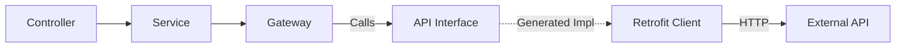

# Retrofit Quick Guide

## Why Retrofit?
Retrofit turns your HTTP API into a Java **Interface**. 
- **Type-Safe**: You define expected inputs/outputs as Java objects.
- **Declarative**: Use annotations (`@GET`, `@POST`) to define requests instead of building manual HTTP connections.
- **Decoupled**: The implementation is generated at runtime giving you a clean separation of concerns.

## The Flow
1. **Interface**: You define *what* the API looks like.
2. **Config**: You build the `Retrofit` object (Base URL + Converter).
3. **Bean Creation**: Spring creates an implementation of your Interface using Retrofit.
4. **Usage**: Inject the interface into your Gateway/Service and call methods.



## Dependencies & Setup
*(From your project)*

### 1. The Interface (`FakeStoreCategoryApi.java`)
Defines the endpoints.
```java
public interface FakeStoreCategoryApi {
    @GET("products/categories") // Relative URL
    Call<List<String>> getAllFakeCategories();
}
```

### 2. The Config (`RetrofitConfig.java`)
Connects the pieces.
- **`Retrofit.Builder`**: Sets the common `baseUrl` ("https://fakestoreapi.com/").
- **`GsonConverterFactory`**: Handles JSON <-> Java Object conversion automatically.
- **`@Bean`**: Creates the actual instance of `FakeStoreCategoryApi` so you can `@Autowired` it.

### 3. The Usage (`FakeStoreCategoryGateway.java`)
```java
// Inject the interface directly
private final FakeStoreCategoryApi fakeStoreCategoryApi;

// Call it
Call<List<String>> call = fakeStoreCategoryApi.getAllFakeCategories();
Response<List<String>> response = call.execute(); // Synchronous call
```
